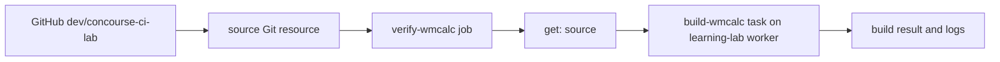

# Tour the Concourse web UI

Open [the lab UI](http://127.0.0.1:8080/) on Yoda while the tunnel and lab VM
are running. Sign in to team `main` if prompted. The URLs below use Yoda's
local tunnel; they will not work from another machine without its own tunnel.

## Why does PR #1 look like another source tree?

`wm-dockapps-ng-pr-1` is a **Concourse pipeline name** chosen when the operator
ran `fly set-pipeline -p wm-dockapps-ng-pr-1`. The `-v
git_branch=dev/concourse-ci-lab` variable made its `source` Git resource watch
that branch. The letters `pr-1` are only our convention to connect this
temporary pipeline to [GitHub PR #1](https://github.com/jmh-devel/wm-dockapps-ng/pull/1).
Concourse has not imported a GitHub PR object and does not publish a GitHub
required status check in this lab.

The WUI draws a graph of **resources and jobs**, not a file browser. In this
pipeline, `source` represents discovered commits on one Git branch, and
`verify-wmcalc` is the job that consumes them. Each pipeline has its own
resource node, branch configuration, and job builds. Concourse can share
version data internally for identical resource configurations. The branch
pipeline appears as a separate graph because it was configured separately,
even though it reads the same GitHub repository. A build's `get: source` step
fetches the selected commit and makes
it available to the task as the `source` input directory. The task definition
comes from `source/ci/tasks/verify-wmcalc.yml` in that fetched commit.

## Click through the live build

1. On the [pipeline list](http://127.0.0.1:8080/teams/main/pipelines), open
   [wm-dockapps-ng-pr-1](http://127.0.0.1:8080/teams/main/pipelines/wm-dockapps-ng-pr-1).
   Its graph has one `source` resource and one `verify-wmcalc` job. The job is
   green after a successful build.
2. Open the `source` resource. Its **Versions** view lists commit refs.
   `86f7ae344c50b31d206a77bd078b4cd9580656ce` was the successful build
   #3 input. The **Checks** view shows Concourse polling GitHub for versions;
   a check discovers a commit but does not compile code.
3. Return to the graph and open `verify-wmcalc`. Its build history shows build
   numbers, status, and duration. [Build #3](http://127.0.0.1:8080/teams/main/pipelines/wm-dockapps-ng-pr-1/jobs/verify-wmcalc/builds/3)
   succeeded for the exact PR head at the time of that build.
4. In a build, expand **get: source**. That step fetches the selected Git
   version. Expand **build-wmcalc** for the task container log: Debian package
   setup, `autoreconf`, `configure`, compiler output, and `make check`. The
   final `make check` line says there were no declared tests; the gate is a
   compile smoke check.
5. Compare the [pipeline YAML](../ci/pipeline.yml) with the graph, then the
   [task YAML](../ci/tasks/verify-wmcalc.yml) with the build log. The pipeline
   controls when and what to fetch; the task controls the container image,
   inputs, and shell commands.

## What the other entries are

| Pipeline | Purpose | Current state |
| --- | --- | --- |
| `wm-dockapps-ng-pr-1` | Branch build for GitHub PR #1 | Active; checks `dev/concourse-ci-lab` about once a minute. |
| `wm-dockapps-ng-source-probe` | First test of public Git fetch, before the compile task existed | Paused; its build history remains visible. |
| `ts-concourse-demo-main` | The separate private Python learning repo | Active; follows its `main` branch. |
| `ts-concourse-demo-pr-1` | An older temporary branch pipeline for that separate repo | Paused. |

There is no `wm-dockapps-ng` **master** pipeline yet. The first one was scoped
to the development branch so the unmerged CI change could be tested. When a
merge is approved, an operator can apply the same versioned pipeline with
`-v git_branch=master` under a distinct main pipeline name and confirm its
first build observes the merged commit.

## Controls and one important distinction

- **Check resource** asks Concourse to look for a new Git commit. The
  `trigger: true` on `get: source` queues a job build when a new version is
  available. **Trigger job** asks for a build manually; inspect the `get` step
  to confirm which version it selected.
- **Pause pipeline** stops automatic job scheduling without deleting its build
  history. Deleting the pipeline removes that history from the lab.
- Committing a changed `ci/pipeline.yml` does not update Concourse's applied
  pipeline configuration by itself. Reapply it with `fly set-pipeline`, then
  observe a build of the commit containing the change.

Official references: [pipelines](https://concourse-ci.org/docs/pipelines/),
[resources](https://concourse-ci.org/docs/resources/),
[get steps](https://concourse-ci.org/docs/steps/get/), and
[tasks](https://concourse-ci.org/docs/tasks/).
